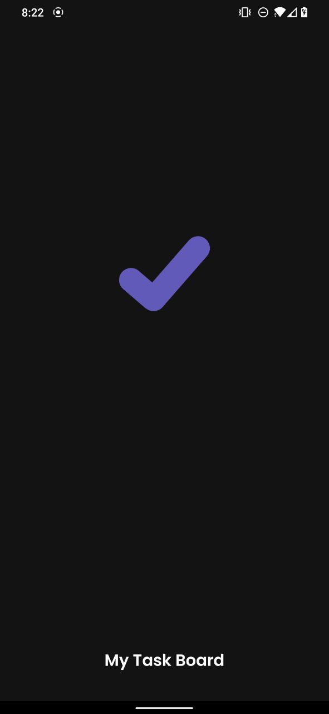
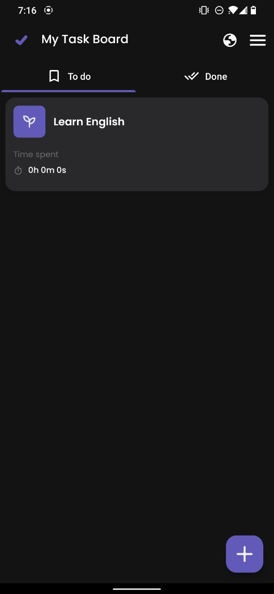
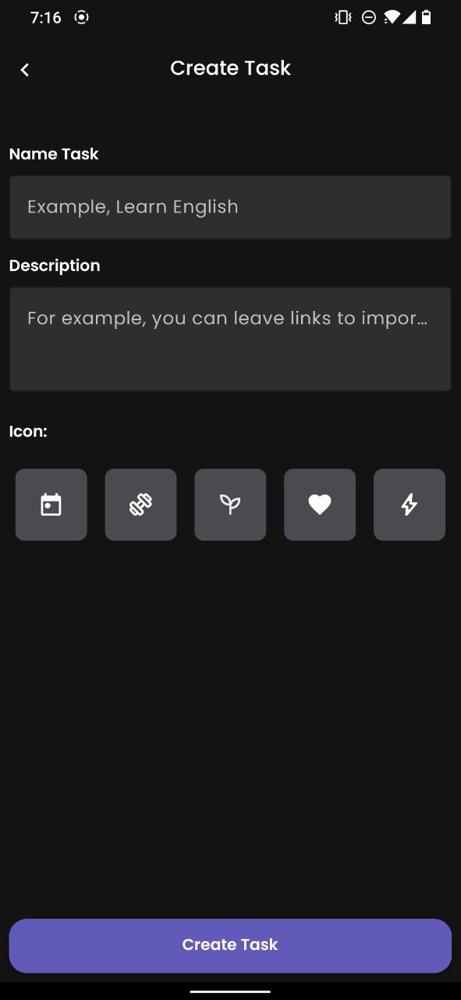

# My Task Board
- This is a My-Task-Board, you can create a task in it, and after working on it, 
you can add the minutes spent on the task, 
after completing it, you can simply delete it!
- **Downlaod Application**: [link](https://github.com/Deizerok/My-Task-Board/releases/tag/v1.0)
- ## Features
- Create Task
- Start StopWatch for task (Start Session)
- Finish Task
- Restore Task
- Delete Task
## System requirements
- Recommended system: Android 9 SDK 28
- Android Studio
- Git
- Kotlin
## How to support me
- just click on the star to make it glow yellow!
## UI Screenshots

